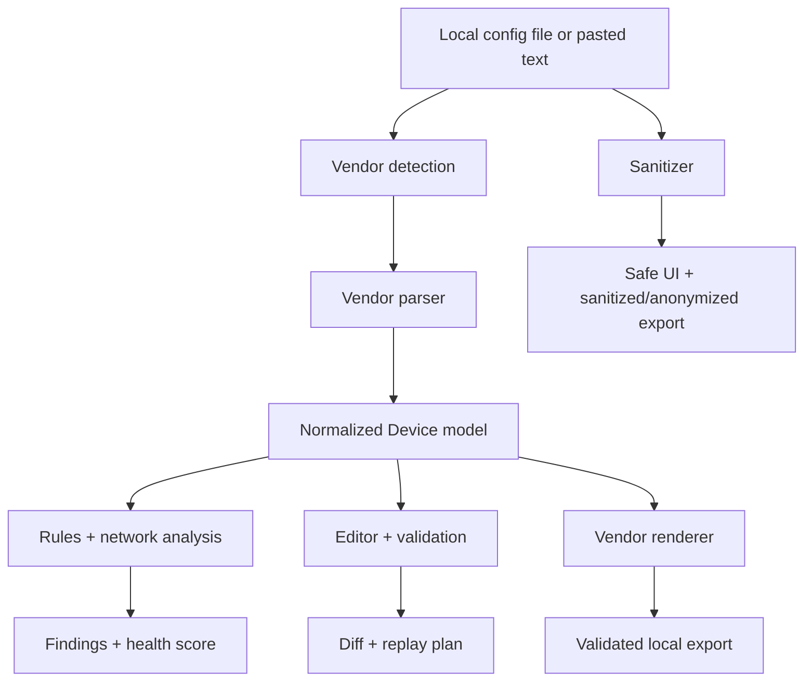

# NetConfig Intelligence

Network Configuration Analysis, Security Auditing & Safe Editing Platform.

Local-only tooling for Cisco IOS/IOS-XE and MikroTik RouterOS configurations:
parse a real device config into a vendor-neutral model, find security and
consistency problems, safely edit it through that model (not text
find/replace), and export a clean diff, a dependency-aware replay plan, or a
sanitized/anonymized copy to share. Nothing ever leaves the machine this
runs on — no cloud calls, no telemetry, no external AI.

## Features

- **Vendor-plugin parsers** — Cisco IOS, Cisco IOS-XE, and MikroTik RouterOS
  `/export` text, each producing the same normalized `Device` model.
- **Automatic vendor detection** with a confidence score, overridable by hand.
- **Secret sanitization with a local-only reveal path** — credentials are
  masked by default; you can explicitly reveal what's actually recoverable
  (plaintext values, and Cisco's reversible type 7 cipher) without ever
  attempting to crack a real one-way hash (type 5/8/9). See [Security](#security--privacy).
- **Two levels of safe sharing**: *Sanitized* (credentials + device
  identifiers masked, IPs/hostname kept for troubleshooting) and *Fully
  anonymized* (also masks the hostname and public IPs).
- **Rule engine**: ~20 vendor-specific security/config rules (Telnet,
  default SNMP communities, weak password storage, permissive ACLs, missing
  banners, exposed MikroTik management services, weak firewall policy, …)
  plus an IPv4 calculator that catches overlapping/duplicate networks,
  invalid host addresses, and DHCP ranges/gateways outside their subnet.
- **Explainable health score** (0–100, overall + per category) — a plain
  deduction from known findings, never a black box.
- **Safe editing, API-first**: interface IP/description edits go through the
  normalized model (never raw-text find/replace), then re-render through the
  correct vendor syntax, with a renderer-vs-renderer diff and pre-export
  validation. This is fully implemented and tested in `app/services` and the
  CLI (`netconfig export --interface ...`); the web UI for it is on the
  [roadmap](#roadmap) while it gets a proper structured design.
- **Replay plans** with an explicit honesty notice about what they are and
  aren't — see [Replay plans](#replay-plans).
- **One core, several surfaces** — the web UI, the CLI, and the test suite
  all call the exact same `app/services` layer, so they can't drift apart.

## Supported vendors

| Vendor | Parser | Renderer | Status |
|---|---|---|---|
| Cisco IOS | `app/parsers/cisco/ios.py` | `CiscoIOSRenderer` | Implemented |
| Cisco IOS-XE | `app/parsers/cisco/iosxe.py` | `CiscoIOSXERenderer` | Implemented |
| MikroTik RouterOS | `app/parsers/mikrotik/routeros.py` | `MikroTikRouterOSRenderer` | Implemented |
| Juniper Junos / Arista EOS / Huawei VRP | — | — | Roadmap ([Extending](#extending-to-a-new-vendor)) |

## Architecture



```
app/
  parsers/        vendor plugins -> normalized Device model
  models/          the normalized model itself (device.py) + findings/session
  sanitization/    secret detection, masking, type-7 decode
  analyzers/       IPv4 calculator, health score
  rules/           the rule engine + per-vendor rule sets
  renderers/       Device model -> vendor config text
  services/        orchestration used by BOTH the web app and the CLI
  cli/             thin argparse wrapper around services/
  main.py          FastAPI app + HTTP API
  templates/static  single-page UI (Jinja2 + vanilla JS, dark/light, responsive)
tests/             pytest suite, one file per concern (see Testing)
examples/          sanitized demo configs, safe to open and analyze
```

Adding a vendor means writing a parser + renderer pair; nothing else in the
app changes. See [Extending](#extending-to-a-new-vendor).

## Installation

**Python (Linux/macOS):**

```bash
git clone <this-repo>
cd netconfig-intelligence
python3 -m venv .venv && source .venv/bin/activate
pip install -r requirements.txt
uvicorn app.main:app --reload
```

**Python (Windows PowerShell):**

```powershell
git clone <this-repo>
cd netconfig-intelligence
python -m venv .venv
.venv\Scripts\Activate.ps1
pip install -r requirements.txt
uvicorn app.main:app --reload
```

Open `http://127.0.0.1:8000`.

**Docker:**

```bash
docker compose up --build
```

The Compose service binds only to `127.0.0.1`, runs a read-only root
filesystem, and drops privileges (`no-new-privileges`) — reasonable defaults
for a tool that may see real device credentials.

**Windows `.exe` (no Python required):** grab the latest `.exe` from
[Releases](../../releases) — built automatically by `release.yml` whenever a
`v*` tag is pushed (PyInstaller, via `NetConfig-Intelligence.spec`). To build
it yourself on Windows: `./build_exe.ps1`, then run
`dist/NetConfig-Intelligence.exe` — it starts the same local server and
binds only to `127.0.0.1`.

## Usage

1. Open the app, click one of the **Try a sample** links (or paste/upload
   your own `show running-config` output, or a MikroTik `/export`), pick a
   vendor or leave it on **Auto-detect**, and analyze. The bundled
   `examples/cisco_ios/problematic-router.cfg` deliberately trips most of the
   rule engine so you can see it work end to end.
2. **Findings** — severity, category, and a concrete recommendation for each
   issue, next to the health score breakdown at the top.
3. **Configuration** — the sanitized text in a read-only view. Click
   **Show recoverable passwords** to reveal locally-recoverable credentials
   (plaintext/type 7 only, requires explicit confirmation), or download the
   **sanitized** or **fully anonymized** copy.
4. **Validation** — pre-export checks (network consistency, anything the
   normalized model can't represent).
5. **Replay plan** — a dependency-ordered command sequence to reproduce the
   configuration on a clean device (see [Replay plans](#replay-plans) for
   why that is *not* the same as command history).

Editing a configuration (interface addressing, then diff/validate/export the
result) already works end to end through the CLI and the HTTP API — see
[CLI](#cli) — it just isn't wired into the web UI yet (see
[Roadmap](#roadmap)).

## Security & privacy

- Everything runs in this process. No network egress, no analytics, no
  external AI/LLM calls — this is the entire point of a tool that handles
  device credentials.
- Credentials are masked by default. **Show locally recoverable passwords**
  requires explicit confirmation and only ever shows:
  - values already stored in clear text in the file, or
  - Cisco **type 7** values, decoded via Cisco's own publicly documented,
    deterministic (not brute-forced) cipher.

  Genuine one-way hashes — Cisco type 5 (MD5-crypt), type 8 (PBKDF2-SHA256),
  type 9 (scrypt) — are reported as *present* but are **never** attacked;
  NetConfig Intelligence does not do password cracking.
- Two sharing modes: **sanitized** (mask credentials + MAC addresses, keep
  IPs/hostname) and **fully anonymized** (also mask the hostname and public
  IPs) — pick whichever fits who you're sending it to.
- Secrets are never written to logs.

## Configuration analysis

The rule engine (`app/rules/`) is vendor-scoped and explainable — every
finding carries a stable `rule_id`, severity, category, description, and a
concrete recommendation. Examples: Telnet/HTTP exposed, no `enable secret`,
plaintext or type 7 password storage, default SNMP communities, VTY lines
without an `access-class`, `permit ip any any`, MikroTik management services
(WinBox/SSH/API) with no `address=` restriction, a MikroTik input chain with
no explicit drop rule, masquerade NAT with no `out-interface`. The IPv4
calculator (`app/analyzers/network.py`) independently flags overlapping or
duplicate subnets, host/broadcast addresses configured as a host, and
DHCP ranges/gateways that fall outside their own network — all using
Python's `ipaddress` module, not hand-rolled CIDR math.

## Replay plans

A `show running-config` / RouterOS `/export` **does not contain the CLI
command history** — that simply isn't stored on the device. What
NetConfig Intelligence builds instead is a *dependency-aware reconstruction
order* that would produce the same resulting configuration on a clean
device (global prerequisites → interfaces → VLANs → addressing → routing →
ACL/firewall → NAT → services → management/hardening), with each step
carrying an explanation, its dependencies, and a risk level. The UI and API
respond say this explicitly, and every export/replay response also states
the target platform and a compatibility warning — rendered syntax can vary
across firmware/software versions and should be reviewed before it touches
a production device.

## Development

```bash
pip install -e ".[dev]"
python -m pytest -q
python -m ruff check app tests
python -m mypy app --ignore-missing-imports
```

`.github/workflows/ci.yml` runs all three on every push/PR.

## Testing

```
tests/
  test_cisco_parser.py     block parsing, vendor detection, ACE address forms, merge-on-repeat
  test_mikrotik_parser.py  /export sections, PPP secrets, firewall filter, DHCP pool linking
  test_sanitizer.py        reveal vs. mask, one-way hashes are never revealed
  test_ip_analysis.py      overlap/duplicate/host-vs-broadcast/DHCP range & gateway checks
  test_rules.py            rule engine on the demo fixtures, vendor scoping, health score math
  test_renderer.py         mask math, round-tripping through parse -> render -> parse
  test_diff.py             renderer-vs-renderer diffs (regression test for rendering noise)
  test_replay.py           step ordering, dotted-mask regression, per-vendor syntax
  test_api.py              full HTTP workflow via FastAPI's TestClient
```

`examples/` doubles as the fixture set — sanitized/fabricated data only,
safe to commit and to open in the app.

## CLI

The CLI (`netconfig`, or `python -m app.cli.main`) is a thin wrapper around
the same `app/services` layer the web UI uses:

```bash
netconfig analyze  examples/cisco_ios/problematic-router.cfg
netconfig sanitize examples/mikrotik/branch-router.rsc --mode anonymized
netconfig validate examples/cisco_ios/branch-router.cfg
netconfig replay   examples/cisco_ios/branch-router.cfg
netconfig diff     old.cfg new.cfg
netconfig export   examples/cisco_ios/branch-router.cfg \
                    --interface GigabitEthernet0/0 --address 10.10.20.1 --prefix-length 24
```

## Extending to a new vendor

1. Add `Vendor.YOUR_VENDOR` to `app/models/device.py`.
2. Write a parser implementing `ConfigParser` (see `app/parsers/cisco/` or
   `app/parsers/mikrotik/` for the shape) that fills in the same `Device`
   model — nothing vendor-specific leaks past this boundary.
3. Write a renderer implementing `ConfigRenderer`.
4. Register both in `app/parsers/base.py` / `app/services/__init__.py`.

The rule engine, health score, diff, editor, and replay-plan builder all
work unmodified against any vendor once the model is populated.

## Roadmap

- **Structured interface/object editor in the web UI.** The engine already
  exists and is tested (`app/services/edit_service`-style logic in
  `app/services/__init__.py`: `update_interface`, diff, pre-export
  validation, all reachable via the CLI and the HTTP API today) — it was
  pulled from the web UI while it gets a properly designed multi-object
  editor (interfaces, VLANs, ACLs, NAT, routing, DHCP) instead of a single
  bolted-on form.
- IPv6 editing and additional network rules.
- Juniper Junos, Arista EOS, and Huawei VRP parser/renderer plug-ins.
- Optional encrypted-at-rest local history (disabled by default — the app
  is in-memory only today, so closing it discards the session).

## License

[MIT](LICENSE)
